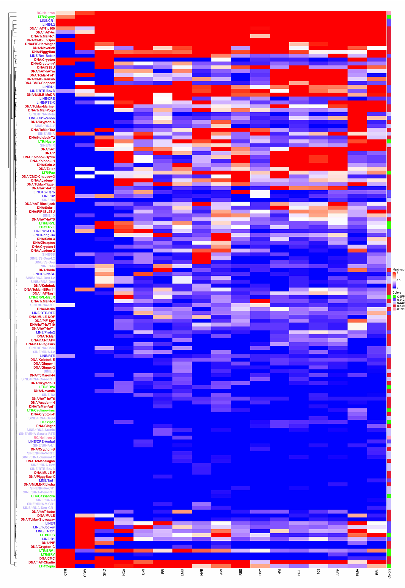

# Visualization of TE coverages
In order to visualize the TE coverages across species, start the R program.
```
R
```
Then, follows the below scripts to visualize the TE coverage.
```
# Load necessary libraries
library(ComplexHeatmap)
library(circlize)

#Load object
dat_3_non_zero_TEproportion <- readRDS("dat_3_non_zero_TEproportion.rds")
MyColors <- readRDS("MyColors.rds")

#Declare TE major class
CLASS <- c(
"SINE",
"LINE",
"LTR",
"DNA",
"RC",
"Unknown",
"Others"
)

#Colors
COLOR <- c("#CCBFFF", "#654CFF", "#32FF00", "#E51932","#FF99BF","grey", "white")
names(COLOR) <- CLASS

#Gradation from white to black
my_palette <- colorRampPalette(c("blue", "red"))(100)

#Color vector
#MyColors <- COLOR[Dfam[rownames(dat_3_non_zero_TEproportion),"V2"]] 
#names(MyColors) <- rownames(dat_3_non_zero_TEproportion)

#Other configurations
breaks <- c(0, 0.5, 1)
colors <- c("blue", "white", "red") # replace with your color choices

# Create a color mapping function
color_fun <- colorRamp2(breaks, colors)

row_anno <- rowAnnotation(df = data.frame(Colors = MyColors),
                          col = list(Colors = c("#CCBFFF"="#CCBFFF", "#654CFF"="#654CFF", "#32FF00"="#32FF00", "#E51932"="#E51932", "#FF99BF"="#FF99BF", "grey"="grey", "white"="white")),
                          width = unit(1, "cm"))

#Generate a heatmap
png("Figures/family_heatmap_annotated_TEproportion_v1.png", width=20000, height=30000, res=500)
Heatmap(
dat_3_non_zero_TEproportion, 
width = ncol(dat_3_non_zero_TEproportion)*unit(25, "mm"),
height = nrow(dat_3_non_zero_TEproportion)*unit(5, "mm"),
name = "Heatmap", 
right_annotation = row_anno,
col=color_fun,
row_names_gp = gpar(col = COLOR[Dfam[rownames(dat_3_non_zero_TEproportion),"V2"]], fontface = "bold"),
row_names_side="left",
cluster_columns =FALSE
)
dev.off()
```

